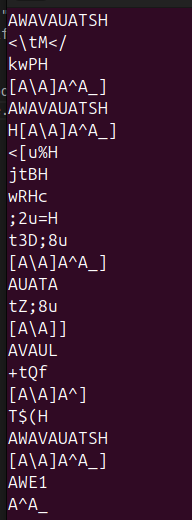

## Challenge Description
This challenge introduces the "strings" command. You will use the command to print the strings from the binary and search the output for a specific word. Provide this word to the "verify" script to receive the flag!

## How It Works
"strings" is a command line tool that prints all of the strings contained within a binary to the screen, one per line. Humans think of strings as readable text, but this isn't always the case. A lot of what "strings" prints to the screen can be nonsense, as shown in the image below. For large binaries, analyzing this output can be tedious, but for smaller binaries it can be simpler. . 

"strings" is simple to use: provide the name of the binary you want strings from after the command. An example is provided below.
```
strings /usr/bin/ssh
```

In some instances, like the command above, the output flies by too quickly to read! You can use the "more" command to slow it down, and press "spacebar" or "enter" to progress through the output. An example is provided below.
```
strings /usr/bin/ssh | more
```

The "|" character is called the pipe character, and discussion about piping commands is outside the scope of this challenge. Search "piping commands linux" to learn more.

## Challenge Steps
Locate the unusual string within the challenge binary. It will be human readable, but it will also contain special characters to make it stand out a bit more.
1. Run "strings" against the challenge binary.
2. Examine the output and locate the challenge string.
3. Run verify and when prompted enter the challenge string.